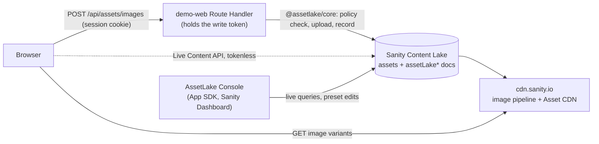

# AssetLake

Public image infrastructure built from Sanity primitives. Your app uploads images through its own backend. AssetLake checks them against a policy you store as content, records each image as a structured document, and browsers load resized, cropped, format-negotiated variants straight from Sanity's Asset CDN.

**Standard Content Lake assets are public by URL. AssetLake MVP is for public images only.**

- **Live demo:** https://assetlake.ejemeniboi.com (uploads need the demo passcode published in the DEV post)
- **Live feed:** https://assetlake.ejemeniboi.com/live (every upload, as it lands, through a tokenless Live Content API client)
- **Sanity project:** `oshzwvjy`, public dataset `production`: [query the AssetLake documents](https://oshzwvjy.api.sanity.io/v2026-10-04/data/query/production?query=*[_type%20match%20%22assetLake*%22])

## Why not a normal object bucket?

This started as an infrastructure question on a Railway stack (frontend, backend, websockets, database, Redis) that needed durable storage and fast public delivery for user images:

- Railway's storage buckets are private. [Public buckets are not supported](https://docs.railway.com/storage-buckets), so serving images means presigned URLs or proxying every read through the backend.
- Putting a CDN in front of object storage adds another provider and another DNS surface. On Cloudflare, for example, a [partial CNAME setup](https://developers.cloudflare.com/dns/zone-setups/partial-setup/) is only on Business and Enterprise plans.
- Both paths still leave resizing, format negotiation and per-image metadata to build yourself.

A Sanity project already has an asset store, an image pipeline, a global CDN, structured content and realtime APIs. AssetLake asks whether those can be the image layer, and wraps them in one server SDK. The backend stays the write and auth boundary. It never becomes an image proxy.

## Sanity features used

| Feature                     | How AssetLake uses it                                                                                                                                                               |
| --------------------------- | ----------------------------------------------------------------------------------------------------------------------------------------------------------------------------------- |
| Content Lake assets         | Every upload is a `sanity.imageAsset`, made with `@sanity/client` `assets.upload("image", ...)` from the server                                                                     |
| Structured schema documents | `assetLakeImage` (one record per upload: owner, purpose, status), `assetLakePolicy` (allowed types, size, dimensions), `assetLakePreset` (named transforms), `assetLakeApplication` |
| Image pipeline              | Presets become URL parameters (`w`, `h`, `fit`, `q`, `auto=format`). No thumbnails are stored                                                                                       |
| Asset CDN                   | Browsers fetch every image from `cdn.sanity.io`. The demo never proxies an image or uses `/_next/image`                                                                             |
| Live Content API            | The public `/live` feed (tokenless) and the console update without polling                                                                                                          |
| App SDK                     | AssetLake Console runs inside the Sanity Dashboard: an overview, live assets, asset detail with every preset, and live preset editing with draft and publish                        |

Workflows and Functions are not used. They were scoped as follow-up work.

## How it works



```text
WRITE  Browser -> authenticated app backend -> @assetlake/core -> Sanity Content Lake
READ   Browser -> cdn.sanity.io
OPS    AssetLake Console (App SDK) -> Sanity Content Lake, live
```

An upload, in order:

1. A replay check runs first: the same actor sending the same `Idempotency-Key` gets the existing record back.
2. The application is resolved, then its default policy.
3. The request is rejected if its declared type isn't allowed, the body is too large, or the bytes don't match the declared type (magic bytes via `file-type`). Nothing reaches Sanity.
4. The asset is uploaded, its dimensions are checked, and the `assetLakeImage` record is created.
5. If anything fails after the upload, the asset is deleted, unless another record still references it (Sanity dedupes identical bytes and answers 409).

The demo adds a passcode session (HMAC-signed `HttpOnly` cookie), 5 uploads per session, a global daily cap, and a 5 MB limit for JPEG, PNG and WebP.

## Workspace

| Path                      | Package                    | Role                                                                                                                 |
| ------------------------- | -------------------------- | -------------------------------------------------------------------------------------------------------------------- |
| `packages/assetlake-core` | `@assetlake/core`          | The SDK on npm: framework-neutral upload, policy, presets, setup, URLs ([README](packages/assetlake-core/README.md)) |
| `packages/assetlake-cli`  | `@assetlake/cli`           | `assetlake init / upload / url / delete / doctor` for your own project ([README](packages/assetlake-cli/README.md))  |
| `packages/sanity-schema`  | `@assetlake/sanity-schema` | Content model, schema deploy, TypeGen (constants come from core)                                                     |
| `apps/demo-web`           | `@assetlake/demo-web`      | Next.js 16 demo: Route Handler upload boundary, playground, live feed, docs ([README](apps/demo-web/README.md))      |
| `apps/asset-console`      | `@assetlake/asset-console` | Sanity App SDK operations console ([README](apps/asset-console/README.md))                                           |
| `examples/express`        | (not in the workspace)     | Minimal Express 5 server on the npm package ([README](examples/express/README.md))                                   |
| `examples/nextjs`         | (not in the workspace)     | Minimal Next.js 16 app on the npm package ([README](examples/nextjs/README.md))                                      |

Stack: Node 24, pnpm workspaces, TypeScript, Next.js 16 (App Router), React 19, `@sanity/client` 8, Sanity App SDK 3, Vitest, Playwright. demo-web runs on Railway (`.railway/railway.ts`); the console is deployed with `sanity deploy`.

## Quick start

The gate lane needs no credentials:

```bash
nvm use            # Node 24 (.nvmrc)
corepack enable
pnpm install
pnpm check         # lint + typecheck + format check
pnpm test          # gate lane: Vitest, every package, no network
```

The build, the live lane, E2E and the dev server need a Sanity project and an Editor token. `next build` imports the server env module, which fails fast when variables are missing. Copy `.env.example` to `.env.local` at the repo root, fill it in, and link it for Next, which only reads env files from the app directory:

```bash
ln -s ../../.env.local apps/demo-web/.env.local
pnpm build
SANITY_DATASET=test pnpm test:live                 # eval lane against a real dataset
pnpm test:pack                                     # pack lane: npm-installed tarballs, plain node
pnpm test:examples                                 # boots examples/* on the packed tarball, uploads to `test`
pnpm seed                                          # demo setup documents (create-if-missing)
ASSETLAKE_DEMO_PASSCODE=... pnpm test:e2e          # Playwright; stop pnpm dev first
pnpm dev                                           # http://localhost:3000
SANITY_WRITE_TOKEN=... ASSETLAKE_SESSION_SECRET=... ./scripts/scan-secrets.sh   # secret scan, after pnpm build
```

To point these at your own project rather than the demo's, see "Use AssetLake with your own Sanity project" below.

## Tests

- **Gate lane** (`pnpm test`, runs in pre-commit): about 420 Vitest tests over core, the schema, demo-web's HTTP and session layer, the console and the secret scanner. It uses in-memory fakes and generated images, with no network and no binary fixtures.
- **Live lane** (`pnpm test:live`): runs against the `test` dataset. It covers the full upload chain (upload, record, transform, CDN fetch, idempotent replay, delete), the bring-your-own-project setup, and the CLI end to end (`init` twice, `doctor`, `upload`, `url`).
- **Pack lane** (`pnpm test:pack`): packs `@assetlake/core` and `@assetlake/cli` the way `pnpm publish` does, installs the tarballs with npm in an empty project, imports every core subpath with plain `node`, runs the `assetlake` bin, and secret-scans the tarballs.
- **Example lane** (`pnpm test:examples`): copies `examples/express` and `examples/nextjs`, installs each with npm and the packed core tarball, typechecks or builds it, starts it, then uploads, builds preset URLs, uploads from a URL and deletes through its HTTP routes against `test`.
- **E2E** (`pnpm test:e2e`): Playwright. The UI lane writes to `production` (what `/live` shows) and the API lane writes to `test`. It checks that every image request goes to `cdn.sanity.io`, and that uploads appear on `/live` without a reload, including when `/live` is opened after the upload. Every test upload is deleted afterwards.
- **Secret scan** (`scripts/scan-secrets.sh`): checks the repo and the browser-served build output for the token values and token-shaped strings. It prints file paths only.

## Security boundary

- **Standard Content Lake assets are public by URL. AssetLake MVP is for public images only.**
- The Sanity write token lives only in server code (`apps/demo-web/lib/server/*`, all `server-only`). An ESLint rule and a gate test keep it out of browser bundles, and the secret scan checks the build output.
- Responses never include upstream error text. Logs redact token, authorization, secret, password and cookie keys at any depth.
- The demo passcode is published on purpose. The real limits are the policy, the magic-byte check, per-session and daily quotas, and the request-size limits.
- The console holds no token. It acts as the signed-in Dashboard user, under that user's project role.

## Known limitations

1. **Public images only.** Standard Content Lake assets are not private.
2. **Not S3-compatible.** AssetLake is an image-service abstraction, not a drop-in S3 protocol replacement.
3. **No custom asset domain.** Images are served from `cdn.sanity.io`. Custom asset domains are an Enterprise add-on.
4. **Deletion is not instant revocation.** CDN caches may keep serving a deleted asset for a while.
5. **The cost profile differs from object storage.** Sanity was chosen for its combined capabilities and developer experience, not for the lowest raw storage price. Usage counts against your plan's asset and bandwidth quotas.
6. **Workflows are not used.** Review lifecycle work is planned on top of Sanity Workflows (early access).
7. **A review status doesn't make an uploaded asset confidential.** Its URL is public from the moment it's uploaded.
8. **No generic file or video pipeline.** The MVP is images only.
9. **No anonymous public uploads in the demo.** A passcode session and quotas are required.
10. **No fabricated analytics.** The console shows only what Sanity documents hold, for example "original bytes of listed assets", not bandwidth.
11. Judges can't open the console without Sanity project membership. It's shown through screenshots and the walkthrough video.
12. The quota floor counters are in process. demo-web runs one replica, and the counters reset on every redeploy (the Sanity-side counts still apply).
13. The console has no Playwright coverage, because it runs inside the authenticated Sanity Dashboard.
14. `/playground` makes about 9 small Sanity reads per render. Batching them needs a core API change.
15. Presets resolve by slug across a dataset, not per application. This is by design (see the bring-your-own section).
16. On the custom domain, CSRF protection (`SameSite=Lax`) relies on every `*.ejemeniboi.com` subdomain being trusted.

## Use AssetLake with your own Sanity project

AssetLake is not a hosted service. Your Sanity project is the bucket: your server holds the token, the images and their records live in your dataset, and browsers load them from `cdn.sanity.io/images/<yourProjectId>/<dataset>/...`. Nothing goes through this repo's demo or its project.

**What you get compared with S3 or R2:** uploads that are checked against a policy you store as content (types, size, magic bytes, dimensions), structured records per image, and resized, cropped, format-negotiated variants from named presets, with no image server of your own.
**What you don't get:** private files (assets are public by URL), quotas beyond your Sanity plan's asset and bandwidth limits, or transforms for non-images. Deleting an asset does not instantly purge CDN caches.

### 1. Project, dataset, token

- A Sanity project with a dataset. AssetLake is for public images: asset URLs are public whatever the dataset's visibility.
- A token with the **Editor** role, created in [sanity.io/manage](https://www.sanity.io/manage) under API, Tokens. Keep it in your server's environment only. Never prefix it with `NEXT_PUBLIC_` and never send it to a browser.

### 2. Create the setup documents

Uploads resolve an application, then its default policy; URLs resolve presets by slug. The CLI creates all three (Node 24):

```bash
export ASSETLAKE_TOKEN=...          # Editor token; the CLI never takes it as a flag
export ASSETLAKE_PROJECT_ID=abc123
export ASSETLAKE_DATASET=production

npx @assetlake/cli init --slug my-app   # policy, 4 presets, assetlake-application-my-app
npx @assetlake/cli doctor --slug my-app # token, write access, visibility, setup, CORS
```

`init` is idempotent and never overwrites existing documents, so presets edited later in the Studio survive a rerun. To do the same from code, use `createSetupPlan` and `assetLake.setup.ensure` (core README, "Set up a project").

**Presets are dataset-global.** A preset slug resolves across the whole dataset, and preset ids are `assetlake-preset-<slug>`, so every application in a dataset shares the `avatar` preset. Give presets distinct slugs when apps need different sizes. Deploying the schema in `packages/sanity-schema` is optional: the Content Lake doesn't need it; it's for Studio editing, TypeGen and the console.

### 3. Upload from your backend

```bash
npm i @assetlake/core
```

```ts
import { createAssetLake } from "@assetlake/core";

const assetLake = createAssetLake({
  projectId: process.env.SANITY_PROJECT_ID!,
  dataset: process.env.SANITY_DATASET!,
  apiVersion: "2026-10-04",
  token: process.env.SANITY_WRITE_TOKEN!,
});

const image = await assetLake.images.upload({
  body: bytes, // Uint8Array
  filename: "photo.png",
  contentType: "image/png",
  applicationId: "assetlake-application-my-app",
  purpose: "avatar",
  entity: { type: "user", id: userId },
  actorId: userId,
});
const avatarUrl = await assetLake.images.url(image.id, { preset: "avatar" });
```

Any server works the same way: Express, Fastify, Next.js Route Handlers, workers, scripts. Browsers build variant URLs with `@assetlake/core/url` and never need the token. Two complete, tested starting points: [`examples/express`](examples/express/README.md) and [`examples/nextjs`](examples/nextjs/README.md). Or upload from a terminal: `npx @assetlake/cli upload ./photo.png --app assetlake-application-my-app --preset avatar`. See the [core](packages/assetlake-core/README.md) and [CLI](packages/assetlake-cli/README.md) READMEs for the full API.

The live lane runs this path against a real dataset (`packages/assetlake-core/tests/live/byo-project.live.test.ts` and `packages/assetlake-cli/tests/live/cli.live.test.ts`), and the pack lane installs the packed tarballs in an empty project.

### 4. Large files: upload from a URL

Sanity has no presigned uploads (every Assets API call needs a token), so browsers can't upload to Sanity directly. To keep large files off your server, upload them to your own bucket with a presigned PUT, then pass a presigned GET URL to `assetLake.images.uploadFromUrl`. Sanity fetches the file itself. It is off until you list your bucket's host in `remoteUploads.allowedHosts`, and its policy checks run after the fetch, so a rejected file is briefly public before AssetLake deletes it. Details in the [core README](packages/assetlake-core/README.md#upload-from-a-url-large-files).
